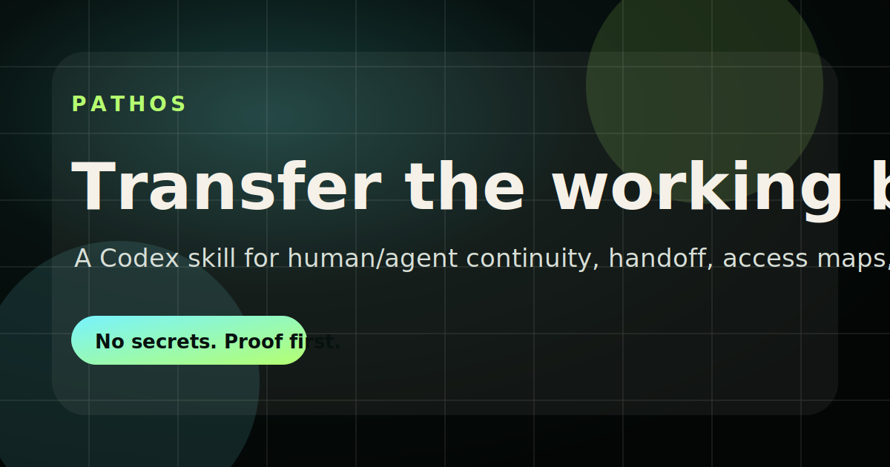

# PATHOS

<p align="center">
  
</p>

<p align="center">
  <a href="https://github.com/maxkle1nz/pathos/actions/workflows/ci.yml"></a>
  <a href="https://github.com/maxkle1nz/pathos/deployments/github-pages"></a>
  <a href="./LICENSE"></a>
  <a href="https://github.com/maxkle1nz/pathos/stargazers"></a>
  <a href="https://github.com/maxkle1nz/pathos/issues"></a>
</p>

<p align="center">
  <strong>The continuity layer for serious human/agent work.</strong>
</p>

<p align="center">
  Created by <a href="https://github.com/maxkle1nz">Max Kleinschmidt</a> ·
  <a href="mailto:kleinz@cosmophonix.com">kleinz@cosmophonix.com</a>
</p>

PATHOS preserves the operational truth that normal handoffs lose: working
cadence, proof discipline, access map, project state, known traps, and the
next-agent prompt that let another model continue without becoming generic.

It is not "memory magic." It is an operational handoff format for agent-era work.

The category is **Human/Agent Continuity**: session handoff and agent-session
hygiene for long-running AI work.

Long Codex windows can get heavy before the work is finished. PATHOS gives you a
clean continuation point before the current window becomes painful to use:
capture, sanitize, backup, and resume in a fresh session with the exact operating
context preserved.

## Quickstart

```bash
git clone https://github.com/maxkle1nz/pathos.git
mkdir -p ~/.codex/skills/pathos
cp -R pathos/skill/. ~/.codex/skills/pathos/
cd pathos
npm install
npm run pathos -- status
```

Then invoke it in Codex:

```text
$pathos
```

Or reference the packaged skill from this repo:

```text
[$pathos](./skill/SKILL.md)
```

## Install

### As a Codex skill

```bash
mkdir -p ~/.codex/skills/pathos
cp -R skill/. ~/.codex/skills/pathos/
```

### As a project protocol

Copy the handoff template into any repo:

```bash
cp skill/references/pathos-handoff-template.md docs/PATHOS.md
```

Then fill the concrete state: branch, proofs, paths, commands, known problems,
first files to read, first commands to run, and the next-agent prompt.

## Why PATHOS Exists

Long agent sessions accumulate more than context. They build a relationship:

- when to move fast;
- when to push back;
- what the human means by "prove it";
- what phrases encode the project's method;
- what claims are still only compatible with the system, not proven by it;
- which paths, tools, MCPs, builds, and artifacts actually matter.

Most handoffs preserve tasks. PATHOS preserves tasks plus the working pattern
that made the tasks succeed.

## Why It Is Different

| Layer | Primary job |
| --- | --- |
| Memory tools | Store and retrieve facts |
| Observability | Trace what happened |
| Prompt/rule files | Tell agents how to behave |
| PATHOS | Transfer operational continuity: state, proof, risk, access, and next moves |

## What PATHOS Captures

| Layer | What gets preserved |
| --- | --- |
| North star | The durable objective and why the work matters |
| Current state | Repo, branch, dirty files, proofs, generated outputs, servers |
| Human/agent pathos | Tone, trust rules, pushback style, decision rhythm |
| Operating doctrine | How to scope, decide, verify, document, and report |
| Access map | Repos, local paths, MCPs, skills, commands, env var names |
| Known problems | Stale indexes, model quota, disk, ports, flaky proof, path moves |
| Proof standard | Tests, runtime checks, artifact gates, browser smoke, non-claims |
| Next prompt | A pasteable startup prompt for the next agent |

## Custodian Mode

PATHOS can also operate as a backup-first session hygiene protocol:

```text
✦ PATHOS CUSTODIAN

SESSION / ARTIFACT              AGE      SIZE      STATUS
current-work                    now      --        handoff ready
old-runs/                       12d      1.4GB     archive candidate
screenshots/                    9d       220MB     dry-run clean

[1] write handoff   [2] backup sanitized
[3] dry-run clean   [4] request approval
```

Custodian Mode is intentionally conservative: handoff first, sanitized backup
second, dry-run cleanup third, and destructive cleanup only after explicit user
approval.

## CLI

PATHOS ships with an executable CLI:

```bash
npm run pathos -- status
npm run pathos -- handoff --write docs/PATHOS.md
npm run pathos -- custodian scan --dry-run
npm run pathos -- custodian backup
npm run pathos -- custodian clean --dry-run
```

If installed as a package, the same commands are available as:

```bash
pathos status
pathos handoff --write docs/PATHOS.md
pathos custodian scan --dry-run
```

Cleanup is safe by default. `custodian clean` only inventories artifacts unless
you pass `--apply --yes`, and even then it moves cleanable artifacts into
`.pathos/trash/<timestamp>` instead of permanently deleting them.
Write commands refuse paths outside the current repository.

The CLI is part of CI, not only documentation. GitHub Actions runs the CLI smoke
test and production build on Node 24 so the public page and command surface stay
future-proof as GitHub moves JavaScript actions forward.

## Session State Example

```text
✦ PATHOS SESSION STATE

PROJECT                 pathos
LOCAL REPO              /path/to/pathos
BRANCH                  main
GIT STATE               clean
LATEST COMMIT           <commit> <subject>
CUSTODIAN               2 cleanable / 3 candidates
```

`pathos status` is intentionally literal: it reports repo state, package
metadata, latest commit, remote, and custodian candidate counts from local
commands.

## Output Shape

PATHOS handoffs use this default structure:

```md
# PATHOS Handoff

## North Star
## Current State
## Human/Agent Pathos
## Operating Doctrine
## Access Map
## Known Problems
## Proof Standard
## Next Agent Prompt
## First Commands
## Do Not Do
## Open Questions
```

## Example Prompt

```text
Use $pathos to preserve this session's working style, project state, access map,
proof standards, known problems, and next-agent prompt. Do not include secret
values. Record env var names and recovery paths only.
```

## Public Landing Page

The repo includes a Vite landing page for PATHOS:

```bash
npm install
npm run dev
npm run build
```

Live site:

```text
https://maxkle1nz.github.io/pathos/
```

## Widgets

The README includes repository badges at the top. A fuller public profile widget
wall is documented in [docs/PROFILE_WIDGETS.md](./docs/PROFILE_WIDGETS.md),
including GitHub stats, streak, trophies, top languages, contribution graph,
profile views, and badge options.

<details>
<summary>Optional public profile widgets</summary>

<p align="center">
  
</p>

<p align="center">
  
</p>

<p align="center">
  
</p>

</details>

## Repo Map

```text
.
├── bin/                   # PATHOS CLI
├── skill/                 # The Codex skill package
├── src/                   # Landing page source
├── public/                # Favicon and Open Graph card
├── docs/                  # Protocol and widget docs
├── scripts/               # README and CLI checks
└── .github/workflows/     # CI and GitHub Pages deploy
```

## Known Limits

- PATHOS transfers observable continuity, not hidden model state.
- It is a handoff protocol, not a secrets manager.
- It records secret names and setup locations, never secret values.
- It improves continuity, but the next agent still needs to verify current repo
  state with real commands.
- The public landing page is a static Vite site; the protocol itself is the
  skill in `skill/`.

## Security

Never put the following into a PATHOS handoff:

- API keys;
- passwords;
- cookies;
- private keys;
- personal tokens;
- raw `.env` values.

Do include:

- environment variable names;
- where credentials are configured;
- who owns access;
- how to recover missing access;
- what is intentionally unavailable.

See [SECURITY.md](./SECURITY.md).

## Contributing

PATHOS is small on purpose. Good contributions make continuity safer, clearer,
and easier to verify. Before opening a PR, read [CONTRIBUTING.md](./CONTRIBUTING.md).

## License

MIT. See [LICENSE](./LICENSE).
